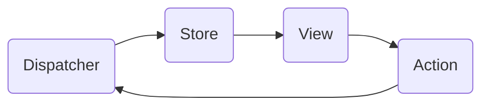
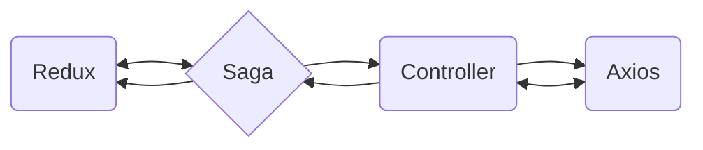

# React-Template!

React-Template é um modelo de painel de administração totalmente responsivo construído com React 18.0.0 e Material-UI.

## Fluxo de requisição

O fluxo de requisição é gerenciado e centralizado no redux baseado na arquitetura Flux.

### Arquitetura flux: 

 - **View** é simplesmente os componentes visuais que são apresentados, ou seja, tudo o que aparece na tela para o usuário.
 - **Dispatcher** é como uma central da sua aplicação. Uma central responsável por registrar callbacks e emitir eventos.   
 - **Store** é responsável por saber quais são os dados que sua view precisa consumir
 

### Requsição ( effects )

E isso produzirá o seguinte fluxograma: 

## Bibliotecas

| Biblioteca | Função |
|--|--|
| axios  | _Axios_ é um cliente HTTP |
| redux  | _Redux_ é utilizado para gerenciar o estado do aplicativo|
| @reduxjs/toolkit  | _Redux Toolkit_ facilita a criação de actions/reducers/constantes usando sua API createSlice|
| redux-Saga  | _Redux_-_saga_ é uma biblioteca que foca em fazer os efeitos colaterais|
| redux-logger| _redux-logger_ é facilitador para debugar reducers|
| i18next  | _I18next_ é um framework de internacionalização|
| notistack| _Notistack_ é um centralizador e gerenciador de notificações|
| @mui/material| _Material UI_ é uma biblioteca de componentes que implementa o Material Design do Google.|
| react-imask  | _react-imask_ é utilizador para implementar campos de textos com máscara com o design do Material UI|

